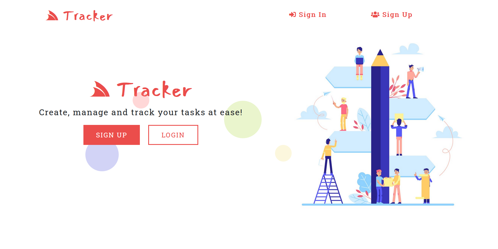
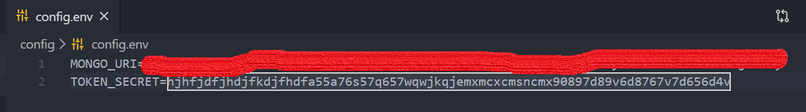
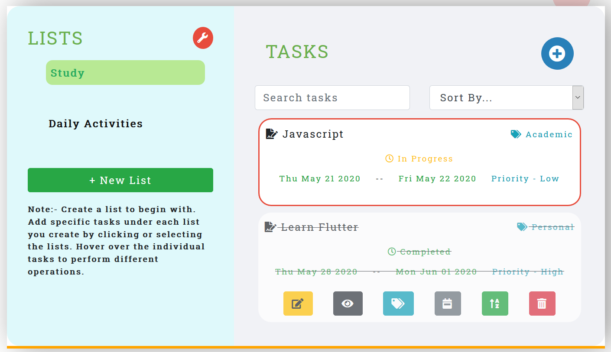

# Tracker - A MEAN Web Application

Application to track and manage all your daily tasks, todos effortlessly.

Live Demo - https://tracker-site.netlify.app

# Pre-Requisites

1.  Must have NodeJS installed in the system.
2.  Must have Angular CLI installed globally to run the front-end.

# Basic steps to follow

1.  Go to https://www.nodejs.org if you don't have NodeJS installed in your system.
2.  To install Angular CLI globally run -> `npm install -g @angular/cli`

# Run the project

1. Clone the repository at `https://github.com/Cshayan/Tracker---MEAN-Task-Manger.git`
2. Go to the folder cloned.

# Setup the environment variables

1. In the folder called config, create a file called `config.env`.
2. In that file `config.env`, set your own MONGO_URI. It is the link which connects with backend application with cloud MongoDB Atlas. Remeber to set your own password in the MONGO_URI.
3. Also set TOKEN_SECRET to some random string containing some combination of alphabets and numbers.
4. In the end, your `config.env` file should look like this -
   `MONGO_URI = YOUR_OWN_URI`
   `TOKEN_SECRET = SOME_RANDOM_STRING_AlPHANUMERIC_CHAR`
   

# Start the application

1. In the root folder, to install all server-side dependencies run -> `npm install`
2. In the same root folder, to install all client-side dependencies run -> `npm run clientinstall`
3. In the same folder as the previous step, start both the server by running -> `npm run dev`.
4. This will start your server at PORT 3000 and client at PORT 4200.
5. In any browser open `http://localhost:4200` to explore the complete application.

# Key functionalities provided in this application

1. Account registration and login for different users.
2. Create lists and sub-tasks under each lists.
3. Edit, Delete and Add Descriptions under each individual tasks.
4. Mark tasks as complete or in-progress according to need.
5. Mark tasks as an important one when required.
6. Specify due dates (starting and ending dates) and priority for each tasks.
7. Add labels to your tasks (like Personal, Work, Shopping or Others).
8. Search tasks by their name.
9. Sort the various tasks according to priority, due dates and labels created.
